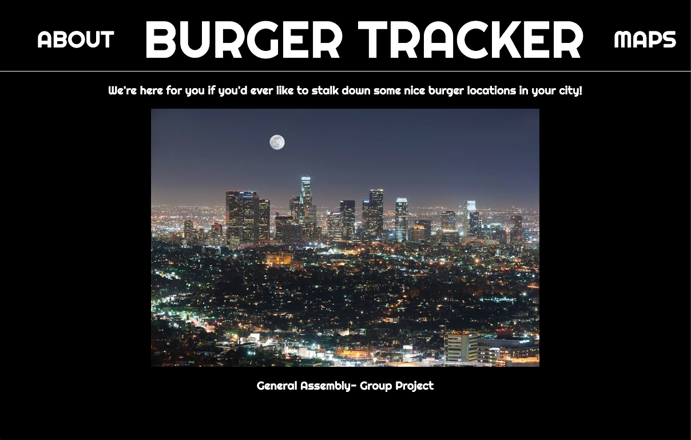

  <a href="#wave-welcome--introductions">Introductions</a>&nbsp;&nbsp;&nbsp;|&nbsp;&nbsp;&nbsp;
  <a href="#pushpin-objectives-of-the-project">Objectives</a>&nbsp;&nbsp;&nbsp;|&nbsp;&nbsp;&nbsp;
  <a href="#gear-technical-components">Technical Components</a>&nbsp;&nbsp;&nbsp;|&nbsp;&nbsp;&nbsp;
  <a href="#calling-features">Features</a>&nbsp;&nbsp;&nbsp;|&nbsp;&nbsp;&nbsp;
  <a href="#inbox_tray-project-backlog">Backlog</a>&nbsp;&nbsp;&nbsp;|&nbsp;&nbsp;&nbsp;
  <a href="#bookmark-attribution">Attribution</a>&nbsp;&nbsp;&nbsp;|&nbsp;&nbsp;&nbsp;
  <a href="#camera_flash-screenshots-of-the-app">Screenshots</a>&nbsp;&nbsp;&nbsp;|&nbsp;&nbsp;&nbsp;
  <a href="#memo-disclaimer">Disclaimer</a>

# Find a Table

## :wave: Welcome & Introductions!

Welcome to the Find a Table repository! Do check out the deployed web app right **_[here](https://findatableapp.herokuapp.com/ "Burger Tracker")_**.

Find a Table is a web app with a finder and booking feature that specializes in looking for the best burger places in town! The features of this app utilizes numerous technical components including but not limited to, HTML5, CSS3, vanilla JS, DOM manipulations, APIs and more.

This project was created as part of the General Assembly software engineering immersive course to challenge us to work in a small team and to put the concepts we've learnt into practice by designing and building a full-stack web app from scratch.

Check out the app, get "meat-ed", and feedbacks on this project are always welcome!

## :pushpin: Objectives of the project

* Craft thoughtful user stories and wireframes

* Making use of an API to request and access data

* Layout and style the front-end with clean & well-formatted CSS

* Manage team contributions and collaboration using a standard Git flow on Github

* Deploy the application online to make it publically accessible 🚀

## :gear: Technical Components

#### Wireframes & User Stories
* Project design and functionality wireframes **_[here](src/assets/wireframes/ "Wireframes")_**

* User stories and features we worked on **_[here](https://trello.com/b/2VouNg8w/ "Project Board")_**

#### Frontend (Page Layout and User Features)
* CSS grid

* JS DOM Manipulations and Event Handling

#### Backend (Node Dependencies)
* Express.js _**4.17.1**_

* Axios _**0.21.0**_

* Embedded JS Templates _**3.1.5**_

## :calling: Features

* Get a list nearby burger joints based on user's location.

* Access any one selected burger joints with a table available for booking.

#### To Do:
* Request and access the data of burger joints through Google Maps Places API.

* Utilize the data available from Google and create our own search results interface (opening times, restaurant images, etc.)

* Implement a simple booking functionality under the restaurant details page.

## :inbox_tray: Project Backlog

* Displaying more than 20 search results upon accessing the map page.

* A table booking system within the app itself that connects to a database for our app.

* Display the restaurant details page as a single page application (without refreshing the page.

## :bookmark: Attribution

[Maps API by Google](https://cloud.google.com/maps-platform/ "Google Maps Platform")

## :camera_flash: Screenshots of the app

#### Homepage of Find a Table

#### Restaurant Finder Map of Find a Table

## :memo: Disclaimer
The contents of these pages are provided as an information guide only. While every effort is made in preparing the material for publication, no responsibility is accepted by or on behalf of the owner(s) for any errors, omissions or misleading statements on these pages or any site to which these pages connect. Although every effort is made to ensure the reliability of listed sites this cannot be taken as an endorsement of these sites.
